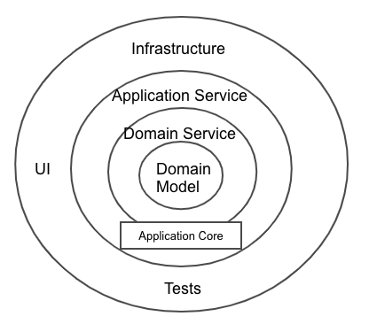

参考資料
https://qiita.com/cocoa-maemae/items/e3f2eabbe0877c2af8d0
https://codezine.jp/article/corner/655

オニオンアーキテクチャの図解

- ドメインモデル
  - ビジネスロジックに関連した状態と振る舞いの一体化したオブジェクトを配置する
    - [Entity](https://developers-book.com/2021/11/03/694/#toc1), [ValueObject](https://zenn.dev/chida/articles/aa2a63cdf2eb52)など
- ドメインサービス
  - ビジネスロジックに関わる振る舞いのロジック、interface などを配置する。
    - [DomainService](https://codezine.jp/article/detail/10318), [IRepository](https://zenn.dev/kohii/articles/e4f325ed011db8)
- アプリケーションサービス

  - アプリケーションサービスの責務は、タスクの調整であり、ユースケースのイベントフローごとにメソッドを提供します。アプリケーションサービスはあくまで調整役のため、薄い処理を行うだけのレイヤーとなります。

- UI
  - controller
- インフラストラクチャー
  - File Access, DB Access, ORM, etc...
- テスト

ドメインモデル層が依存しないことによるメリット

- ドメインモデル層にはビジネスロジックが集約されており、他のモデル層に依存していないため、変更容易性が向上する。開発者はビジネスロジックを変更する場合は、ドメインモデル層にのみ注力すれば良い。
- ドメインモデル層が他のモデル層に依存しないことにより、単体テストや結合テストを行う際のテスト対象を限定しやすくなる。

インターフェース依存のメリット

- モデル間を疎結合に保つ（疎結合）
- モックを利用することで、依存関係を排除してテストを行うことができる。（テスト容易性）
- 複数のモジュールで同じインターフェースを使用することができる。（再利用性の向上）

依存性の逆転

オニオンアーキテクチャは、外側の層が内側の層に依存するようになっているモデルであるが、
内側の層が外側の層に依存が発生する処理については、内側の層がインターフェースを作成し、
外側の層がインターフェースに依存し、依存性を内側の層に注入することで、外側の層が内側の層に依存するようにすることを実現している。これを依存性の逆転という。

どの層に記述するのが適切か。

- リソース操作を制限するアクセス制限機能は、ビジネスルールに関わる機能のため、ドメインモデル層に実装する。一方で、例えば一部ユーザのみユーザ登録を行えるようにするようなユースケースを実現する場合は、ユーザ登録の処理自体はアプリケーション層に記載し、アクセス権限の確認は、ドメインモデル層に実装するのが適切だと思われる。

MySQL から PostgreSQL に変更

- インフラストラクチャー

クイズ

オニオンアーキテクチャにおいて、ドメインモデル層が中心にあるのはなぜですか。

オニオンアーキテクチャでは、ドメインモデル層が中心に位置するのは、ビジネスロジックがアプリケーションの中心であると考えるためです。

ドメインモデル層は、ビジネスロジックを表現するための抽象化レイヤーであり、アプリケーションの中核を担っています。この層は、ドメインモデルを構成するエンティティやバリューオブジェクト、それらを操作するためのリポジトリやサービスなどのコンポーネントから構成されています。

オニオンアーキテクチャでは、ドメインモデル層は、ビジネスロジックの変更によって影響を受ける可能性がある他のレイヤーから隔離されるように設計されています。具体的には、ドメインモデル層は、ビジネスロジックが最初に実装され、変更される場所であるため、ビジネスルールやビジネスプロセスを中心に開発されることになります。

また、オニオンアーキテクチャの考え方では、ドメインモデル層はインフラストラクチャ層やプレゼンテーション層から独立しているため、コアビジネスロジックに集中できるために、これらの層を別々に開発することができます。これにより、ビジネスロジックが独立して開発され、メンテナンスされることができます。

 DDD とオニオンアーキテクチャの違いについて

DDD は、ドメインモデルを中心に据えた設計手法であり、ビジネスの知識やプロセスを抽出し、ビジネスルールをドメインモデルに反映させることで、柔軟性の高いシステムを構築することを目的としています。DDD では、ドメインモデルを中心にしたレイヤーを構築し、インフラストラクチャやアプリケーションの他の部分から隔離しています。DDD は、ビジネスロジックの変更が、システム全体に影響を与えないように、ドメインモデル層を堅牢にすることを目的としています。

一方、オニオンアーキテクチャは、ビジネスロジックを中心に据えた設計手法であり、ビジネスルールの実装をアプリケーションの中心に位置するドメインモデルに集中させることを目的としています。オニオンアーキテクチャでは、ドメインモデル層を中心にして、インフラストラクチャ層とプレゼンテーション層を切り離し、ドメインモデル層が他の層から独立して開発できるようにしています。

つまり、DDD はドメインモデルの設計とビジネスルールの抽出に重点を置き、オニオンアーキテクチャはビジネスロジックの実装とそれに必要なインフラストラクチャの分離に重点を置いています。それでも、DDD とオニオンアーキテクチャは密接に関連しており、両方を組み合わせて使用することができます。

