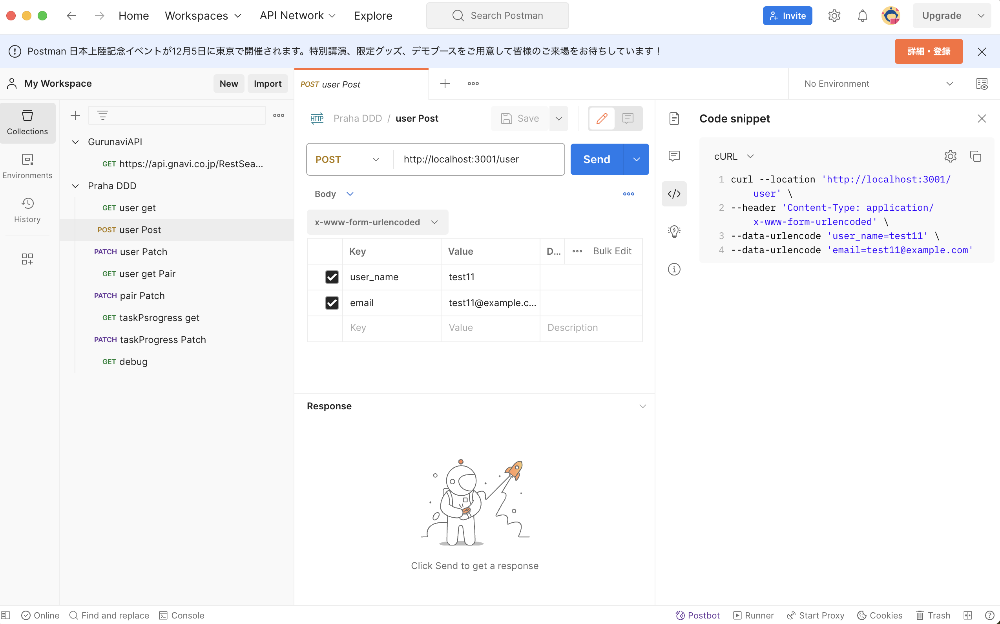

## 問題 1

```
curl -H 'X-Test:hello' https://httpbin.org/headers
```

## 問題 2

```
curl -X POST -H 'Content-Type:application/json' -d '{"name": "hoge"}' https://httpbin.org/post
```

## 問題 3

```
curl -X POST -H 'Content-Type:application/json' -d '{userA: {name: "hoge", age: 29}}' https://httpbin.org/post
```

## 問題 4

```
curl -X POST -H 'Content-Type:application/x-www-form-urlencoded' -d 'name=hoge' https://httpbin.org/post
```

curl クイズ

<details>
 <summary>curl で proxy 認証を突破する方法を教えてください。</summary>
1. -x オプションを利用

```
$ curl www.yahoo.co.jp -x http://{username}:{password}@{proxyサーバIP}:{port}　
```

2. 環境変数に設定

```
export http_proxy=http://{username}:{password}@{proxyサーバIP}:{port}
export https_proxy=http://{username}:{password}@{proxyサーバIP}:{port}　
```

 </details>

 <details>
 <summary>basic認証が必要な場合は、何のオプションを利用すればいいですか？</summary>
1. -u オプションを利用

```
$  curl 'http://localhost:8080/api/json' -u hugahuga:hogehoge
```

 </details>

Postman クイズ

  <details>
 <summary>Postmanで設定したAPIリクエスト例をcurlなどの他の手段で利用したい場合、どうすればいいか。</summary>
1. Code snippetを利用すると良い。

 </details>
